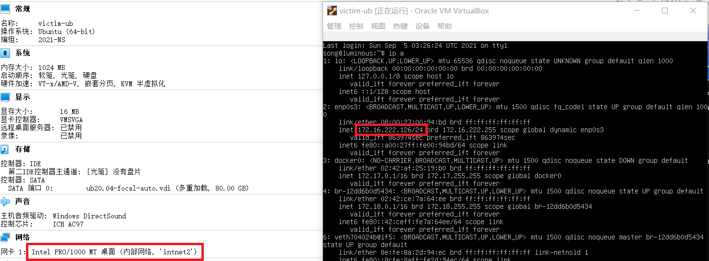
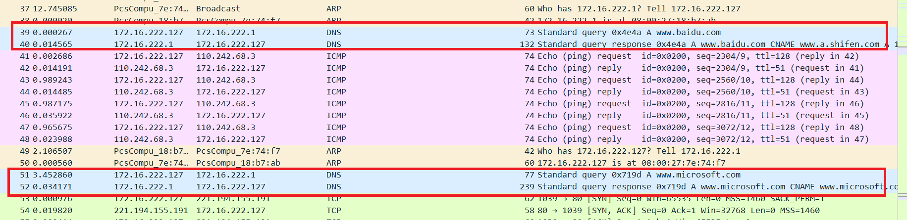

# 基于 VirtualBox 的网络攻防基础环境搭建

## 实验目的

- 掌握 VirtualBox 虚拟机的安装与使用；
- 掌握 VirtualBox 的虚拟网络类型和按需配置；
- 掌握 VirtualBox 的虚拟硬盘多重加载；

## 实验要求
- [x] 虚拟硬盘配置成多重加载；
- [x] 搭建满足如下拓扑图所示的虚拟机网络拓扑；

- [x] 完成以下网络连通性测试；
    - [x] 靶机可以直接访问攻击者主机
    - [x] 攻击者主机无法直接访问靶机
    - [x] 网关可以直接访问攻击者主机和靶机
    - [x] 靶机的所有对外上下行流量必须经过网关
    - [x] 所有节点均可以访问互联网

## 实验环境
1. 网络拓扑

    

2. 虚拟机配置
  - 四台靶机：
    - intnet1
      - kali-victim
      - victim-xp-1
    - intnet2
      - victim-ub
      - victim-xp-2
  - 一台网关
    - Gateway-debian
  - 一台攻击机
    - Attack-kali

## 实验过程

### 虚拟机配置

- 虚拟硬盘配置为多重加载
- 
- 利用多重加载后的硬盘创建所需的虚拟机
- 

### 网络配置

- #### 配置网关网络

  四块网卡

  - NAT网络：网关可以访问攻击者主机
  - Host-Only：方便使用ssh
  - 两个内部网络：搭建出两个独立的网络
  - 

```shell
# 切换为root用户
su
# 修改网络配置文件
vi /etc/network/interfaces

# 重启两块内部网卡
/sbin/ifup enp0s9
/sbin/ifup enp0s10

# 安装dnsmasq
apt update && apt install dnsmasq

# 修改dns配置
#修改/etc/dnsmasq.d/gw-enp09.conf
interface=enp0s9
dhcp-range=172.16.111.100,172.16.111.150,240h


#修改/etc/dnsmasq.d/gw-enp10.conf
interface=enp0s10
dhcp-range=172.16.222.100,172.16.222.150,240h

#备份dnsmasq.conf文件
cp dnsmasq.conf dnsmasq.conf.bak

#修改dnsmasq.conf文件
#log-dhcp--->log-dhcp
#log-queries--->log-queries
#在log-queries下面加一条命令
log-facility=/var/log/dnsmasq.log

# 重启dnsmasq
systemctl restart dnsmasq
```


- #### 配置Attack网络

Nat网络，与网关NAT网络相同


- #### 配置四台靶机网络

  - victim-xp-1：内部网络 intnet1

  

  - victim-kali：内部网络 intnet1

  

  - victim-xp-2：内部网络 intnet2
  
  
  
  - victim-ub：内部网络 intnet2
  
  
  
- 所有虚拟机ip地址总结

|       id       |    ip address     |
| :------------: | :---------------: |
| Gateway-debian |   10.0.2.15/24    |
|                | 192.168.56.119/24 |
|                |  172.16.111.1/24  |
|                |  172.16.222.1/24  |
| attacker-kali  |    10.0.2.5/24    |
|  victim-kali   | 172.16.111.121/24 |
|  victim-xp-1   | 172.16.111.101/24 |
|  victim-xp-2   | 172.16.222.127/24 |
|   victim-ub    | 172.16.222.126/24 |

### 网络连通性测试

#### 1. 靶机可以直接访问攻击者主机

xp1 ping attacker


victim-kali ping attacker


xp2 ping attacker


ub ping attacker


#### 2. 攻击者主机无法直接访问靶机


#### 3. 网关可以直接访问攻击者主机和靶机


#### 4. 靶机的所有对外上下行流量必须经过网关

```shell
# 安装tmux
apt update && apt install tmux
# 安装tcpdump
apt install tcpdump
# 抓包
/sbin/tcpdump -i enp0s9 -n -w 20210907-1.pcap
/sbin/tcpdump -i enp0s10 -n -w 20210907-2.pcap
```

victim-xp-1 对外上下行流量会经过网关


victim-kali 对外上下行流量会经过网关


victim-xp-2 对外上下行流量会经过网关



victim-ub 对外上下行流量会经过网关


#### 5. 所有节点均可以访问互联网

gateway


victim-kali


victim-xp-1


victim-xp-2


victim-ub


## 参考资料

- [2020-ns-public-Crrrln](https://github.com/CUCCS/2020-ns-public-Crrrln/blob/chap0x01/chap0x01/%E5%AE%9E%E9%AA%8C%E6%8A%A5%E5%91%8A.md)

  
