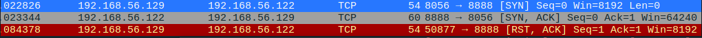
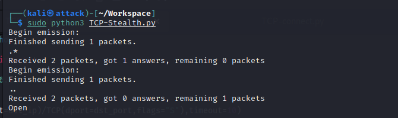
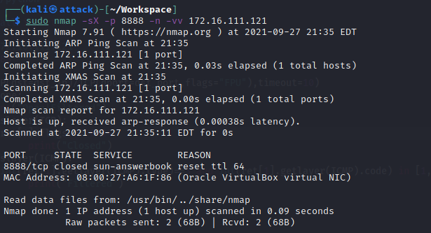
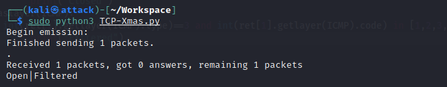
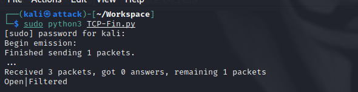
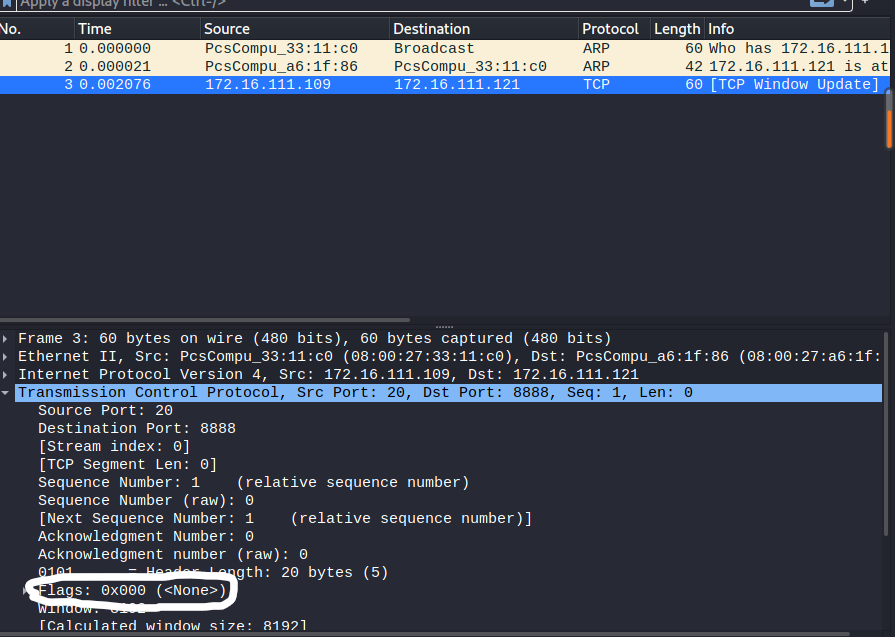

# 基于Scapy编写端口扫描器

## 实验目的

- 掌握网络扫描之端口状态探测的基本原理

## 实验环境

- Python 3.9.2
- Scapy 2.4.4
- nmap  7.91

## 实验要求

- [x] 禁止探测互联网上的IP，严格遵守网络安全相关法律法规
- [x] 完成以下扫描技术的编程实现
  - [x] TCP connect scan / TCP stealth scan
  - [x] TCP Xmas scan /TCP fin scan / TCP null scan 
  - [x] UDP scan
- [x] 上述每种扫描技术的实现测试均需要测试端口状态为：`开放`、`关闭` 和 `过滤` 状态时的程序执行结果
- [x] 提供每一次扫描测试的抓包结果并分析与课本中的扫描方法原理是否相符？如果不同，试分析原因；
- [x] 在实验报告中详细说明实验网络环境拓扑、被测试 IP 的端口状态是如何模拟的
- [x] 复刻 `nmap` 的上述扫描技术实现的命令行参数开关

## 实验先修知识

- kali中端口开启/关闭及监听相关端口的命令

```shell
## 使用防火墙
#允许端口访问
sudo ufw enable && ufw allow portno/tcp(udp)
#停用端口访问
sudo ufw disable
#端口过滤
sudo ufw enable && sudo ufw deny 8888/tcp(udp)
## 使用iptables
# 允许端口访问
sudo iptables -A INPUT -p tcp --dport 8888 -j ACCEPT
# 端口过滤
sudo iptables -A INPUT -p tcp --dport 8888 -j DROP
#指定端口监听
nc -l -p 8888
lsof -i 4 -L -P -n//查看处于监听状态的端口
```

## 实验过程

### 网络拓扑


### TCP connect scan

- 攻击者向靶机发送SYN包，如果能完成三次握手（收到ACK），则端口为开放状态；如果只收到一个RST包，则端口为关闭状态；如果什么都没有收到，则端口为过滤状态

#### 实验代码

```python
#! /usr/bin/python

from scapy.all import *

dst_ip = "192.168.56.122"
dst_port=8888

ret = sr1(IP(dst=dst_ip)/TCP(dport=dst_port,flags="S"),timeout=10)
if ret is None:
    print("Filtered")
elif ret.haslayer(TCP):
    if ret[1].flags == 0x12:
    	send_rst = sr(IP(dst=dst_ip)/TCP(sport=src_port,dport=dst_port,flags="AR"),timeout=10)
        print("Open")
    elif ret[1].flags == 0x14:
        print("Closed")
```

#### 实验结果

**close**


抓包结果

```shell
sudo tcpdump -i eth0 -w tcp-connect-close.pcap
```


攻击者接收道德为RST/ACK数据包，说明8888端口处于关闭状态，与预期相符

使用nmap复刻结果


**filter**


抓包结果


查看结果发现确实只有一个TCP包，说明端口处于过滤状态，与预期相符合

nmap复刻


**open**

要先删除前面的过滤条件，同时开启监听


抓包结果



在抓包的结果中收到了被扫描端的SYN/ACK，扫描端也发出了ACK，是一个完整的握手过程，但RST与ACK同时发出，说明端口开启，和预期相符合

nmap复刻


### TCP stealth scan

这种扫描技术和connect scan很相似。攻击者发送SYN包给受害者，如果端口开启，就会收到SYN/ACK响应包，但此时攻击者会发送RST数据包给受害者，来避免完成一个完整的TCP三次握手过程，避免被防火墙探测到。当端口关闭时，攻击者会收到RST数据包；当端口处于过滤状态时，会无数据包返回或受到数据包的ICMP错误包，显示不可达错误(type =3 code 1,2,3,9,10,13)

#### 实验代码

```python
#! /usr/bin/python

from scapy.all import *

dst_ip = "172.16.111.121"
dst_port=8888

ret = sr1(IP(dst=dst_ip)/TCP(dport=dst_port,flags="S"),timeout=10)
if ret is None:
    print("Filtered")
elif ret.haslayer(TCP):
    if ret[1].flags == 0x12:
    	send_rst=sr1(IP(dst=dst_ip)/TCP(dport=dst_port,flags="R"),timeout=10)
        print("Open")
    elif ret[1].flags == 0x14:
        print("Closed")
elif ret.haslayer(ICMP):
	if int(ret.getlayer(ICMP).type)==3 and int(ret.getlayer(ICMP).code) in [1,2,3,9,10,13]:
		print("Filtered")
```

#### 实验结果

**close**


抓包结果


查看抓包结果确实发现被害者发送的数据包为RST/ACK数据包，说明端口关闭

nmap复刻


**filter**


抓包结果


在抓包的结果中都是受害者只收到了一个TCP包，并没有遇到发送错误ICMP包的情况，但也可以说明端口是关闭的

nmap复刻


**open**




抓包结果


在抓包的结果中看到被害者是发送了SYN/ACK数据包，说明端口开启。且收到了攻击者发送的RST数据包，说明是进行了SYN扫描

**nmap复刻**


### TCP Xmas scan

在Xmas扫描中，攻击者发送的TCP数据包中设置PSH、FIN和URG位。


#### 实验代码

```python
#! /usr/bin/python

from scapy.all import *

dst_ip = "172.16.111.121"
dst_port=8888

ret = sr1(IP(dst=dst_ip)/TCP(dport=dst_port,flags="FPU"),timeout=10)
if ret is None:
	print("Open|Filtered")
elif ret.haslayer(TCP):
	if ret[1].flags == 0x14:
		print("Closed")
elif ret.haslayer(ICMP):
	if int(ret[1].getlayer(ICMP).type)==3 and int(ret[1].getlayer(ICMP).code) in [1,2,3,9,10,13]:
		print("Filtered")
```

#### 实验结果

**close**


抓包结果


分析：在抓包结果中被攻击者发送了RST/ACK数据包，说明端口关闭

nmap复刻



**filter**




抓包结果


分析：靶机只收到了一个TCP包且没有响应，说明靶机端口处于过滤或开启状态，与预期相符合

nmap复刻


**open**


抓包结果


分析：靶机只收到了一个TCP包且没有响应，说明靶机端口处于过滤或开启状态，与预期相符合

nmap复刻


### TCP fin scan

在攻击者发送TCP数据包时仅设置 TCP FIN 位。端口判断与Xmas扫描一致

#### 实验代码

```python
#! /usr/bin/python

from scapy.all import *

dst_ip = "172.16.111.121"
dst_port=8888

ret = sr1(IP(dst=dst_ip)/TCP(dport=dst_port,flags="F"),timeout=10)
if ret is None:
	print("Open|Filtered")
elif ret.haslayer(TCP):
	if ret[1].flags == 0x14:
		print("Closed")
elif ret.haslayer(ICMP):
	if int(ret[1].getlayer(ICMP).type)==3 and int(ret[1].getlayer(ICMP).code) in [1,2,3,9,10,13]:
		print("Filtered")
```

#### 实验结果

**close**


抓包结果


分析：在抓包结果中被攻击者发送了RST/ACK数据包，说明端口关闭

nmap复刻


**filter**


抓包结果


分析：靶机只收到了一个TCP包且没有响应，说明靶机端口处于过滤或开启状态，与预期相符合

nmap复刻


**open**




抓包结果


分析：靶机只收到了一个TCP包且没有响应，说明靶机端口处于过滤或开启状态，与预期相符合

nmap复刻


### TCP null scan

在攻击者发送TCP数据包时不设置任何位。端口判断与Xmas扫描一致

#### 实验代码

```python
#! /usr/bin/python

from scapy.all import *

dst_ip = "172.16.111.121"
dst_port=8888

ret = sr1(IP(dst=dst_ip)/TCP(dport=dst_port,flags=""),timeout=10)
if ret is None:
	print("Open|Filtered")
elif ret.haslayer(TCP):
	if ret[1].flags == 0x14:
		print("Closed")
elif ret.haslayer(ICMP):
	if int(ret[1].getlayer(ICMP).type)==3 and int(ret[1].getlayer(ICMP).code) in [1,2,3,9,10,13]:
		print("Filtered")
```

#### 实验结果

**close**


抓包结果


分析：在抓包结果中被攻击者发送了RST/ACK数据包，说明端口关闭

nmap复刻


**filter**


抓包结果



分析：靶机只收到了一个TCP包且没有响应，说明靶机端口处于过滤或开启状态，与预期相符合

nmap复刻


**open**


抓包结果


分析：靶机只收到了一个TCP包且没有响应，说明靶机端口处于过滤或开启状态，与预期相符合

nmap复刻


### UDP scan

UDP是一种无连接的传输协议，它不保证数据包一定到达目的地。当攻击者收到来自靶机的UDP响应包时，说明端口处于开启状态，但同时如果没有得到响应，端口也可能处于开启或过滤状态；如果收到ICMP端口不可达错误，说明端口关闭；如果是其他ICMP错误，说明端口处于过滤状态。

#### 实验代码

```python
#! /usr/bin/python

from scapy.all import *

dst_ip="172.16.111.121"
dst_port=53

pkt = IP(dst=dst_ip)/UDP(dport=dst_port)
ret = sr1(pkt,timeout=10)
if ret is None:
	print("Open|Filtered")
elif ret.haslayer(UDP):
	print("Open")
elif ret.haslayer(ICMP):
	if int(ret.getlayer(ICMP).type)==3 and int(ret.getlayer(ICMP).code)==3:
		print("Close")
	elif int(ret.getlayer(ICMP).type)==3 and int(ret.getlayer(ICMP).code) in [1,2,9,10,13]:
		print("Filtered")
elif ret.haslayer(IP) and ret.getlayer(IP).proto == 17:
        print("Open")
```


#### 实验结果

**close**


抓包结果


分析：靶机收到了来自攻击者的UDP数据包，并且发送了ICMP端口不可达的数据包，在ICMP数据中Type和code均为3，说明端口关闭，符合预期结果

nmap复刻


**filter**


抓包结果


分析：在靶机中收到了来自攻击者的UDP数据包，但没有做任何响应，说明端口处于过滤状态==或开启状态==，与预期相符合

nmap复刻


**open**


抓包结果


分析：抓取的包中可看到靶机接收到了攻击者发送的UDP数据包，并发送了响应包，说明端口开启，与预期相符合

nmap复刻


## 问题与解决方法

1. tcp connect scan时端口无法正常开启

   `nc -lvp 8888`只有在监听时端口才是确保开启的
   
2. 在开启udp端口时，发送数据包总是没有响应

   `nc -l -u -p 53 < /etc/passwd`将监听命令改为上述，即可得到响应包，此时靶机向攻击者发送了/etc/passwd而不是空UDP包
   
3. 在进行tcp connect scan时使用python脚本扫描端没有向被害者发送ACK包，而是直接发送了[RST,ACK]包


但在使用nmap时，是进行了一个整个的三次握手过程


## 参考资料

- [python_scapy实现TCP端口扫描](https://blog.csdn.net/rootkitylp/article/details/53174110)

- [Linux kali开启端口、关闭防火墙方法](https://blog.csdn.net/qq_42103479/article/details/90111365)

- [CUCCS/2020-ns-public-Crrrln](https://github.com/CUCCS/2020-ns-public-Crrrln/blob/chap0x05/chap0x05/exp5.md)

- [Nmap Network Scanning](https://nmap.org/book/synscan.html)

- [Port scanning using Scapy](https://resources.infosecinstitute.com/topic/port-scanning-using-scapy/)

  

