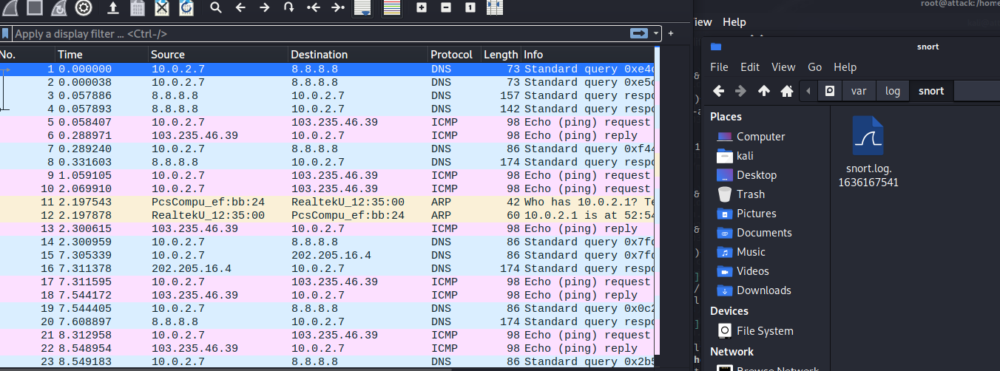
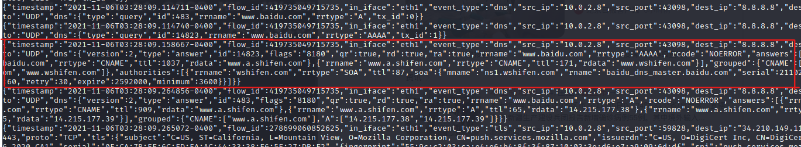

# 入侵检测

## 实验目的

- 了解IPS和IDS的概念
- 学会使用Snort和Suricata作为检测工具

## 实验环境

- kali 2021.2

### 网络拓扑


## 实验过程

### Snort

#### 实验一：配置snort为嗅探模式

> *Sniffer mode,* which simply reads the packets off of the network and displays them for you in a continuous stream on the console (screen)
>
> ​																															---------Snort Document

```shell
# 显示IP/TCP/UDP/ICMP头
snort -v
```


```shell
# 显示应用层数据
snort -vd
```


```shell
# 显示数据链路层报文头
snort -q -vde -i eth1
```


```shell
# -b 参数表示报文存储格式为 tcpdump 格式文件
# -q 静默操作，不显示版本欢迎信息和初始化信息
snort -q -v -b -i eth1 "port not 22"
```

 

```shell
# 使用 CTRL-C 退出嗅探模式
# 嗅探到的数据包会保存在 /var/log/snort/snort.log.<epoch timestamp>
# 其中<epoch timestamp>为抓包开始时间的UNIX Epoch Time格式串
# 可以通过命令 date -d @<epoch timestamp> 转换时间为人类可读格式
# exampel: date -d @1511870195 转换时间为人类可读格式
# 上述命令用tshark等价实现如下：
tshark -i eth1 -f "port not 22" -w 1_tshark.pcap
```


#### 实验二：配置并启用snort内置规则

```shell
# /etc/snort/snort.conf 中的 HOME_NET 和 EXTERNAL_NET 需要正确定义
# 例如，学习实验目的，可以将上述两个变量值均设置为 any
snort -q -A console -b -i eth1 -c /etc/snort/snort.conf -l /var/log/snort/
```

- 查看snort.conf配置文件中的规则，并将其中的HOMT_NET和EXTERNAL_NET定义为any


- 启用内置规则

####  实验三：自定义snort规则

```shell
# 新建自定义 snort 规则文件
cat << EOF > /etc/snort/rules/icmp-info.rules
alert icmp $EXTERNAL_NET any -> $HOME_NET any (msg:"ICMP Large ICMP Packet"; dsize:>800; reference:arachnids,246; classtype:bad-unknown; sid:499; rev:4;)
# 利用Snort检测ping攻击
```

```shell
# 添加配置代码到 /etc/snort/snort.conf
include $RULE_PATH/icmp-info.rules
```


```shell
snort -q -A fast -b -i eth0 -c /etc/snort/snort.conf -l /var/log/snort/
```

使用另一台victim-kali对其发送字节数为1000的icmp包

```shell
ping -s 1000 192.168.56.123
```


可以看出来，确实发生了报警。

####  实验四：和防火墙联动

```shell
# 解压缩 Guardian-1.7.tar.gz
tar zxf guardian.tar.gz

# 安装 Guardian 的依赖 lib
apt install libperl4-corelibs-perl
```

- 在Attack-kali中开启`snort`和`guardian.pl`

```shell
snort -q -A fast -b -i eth1 -c /etc/snort/snort.conf -l /var/log/snort/
```

- 编辑 guardian.conf 并保存，确认以下2个参数的配置符合主机的实际环境参数。


在victim-kali中对attack进行nmap扫描


说明在扫描的过程中，Snort配合Iptables完成了阻断攻击。

### Suricata

#### 实验一：配置 suricata 为嗅探模式

首先修改suricata.yaml文件的HOME_NET和EXTERNAL_NET为any


```shell
suricata -c /etc/suricata/suricata.yaml -i eth0    
# 使用suricata.yaml规则在eth0上开启监控服务
```

```shell
# 查看json格式的日志
cat /vat/log/suricata/eve.json
```



发现在日志中确实有记录，说明测试正常。

#### 实验二：自定义suricata规则

```shell
#新建自定义suricata规则文件
vim /var/lib/suricata/rules/test.rules
#修改内容如下
alert tcp any any -> any any (msg:"hit baidu.com...";content:"baidu"; reference:url, www.baidu.com;)
# 将此文件加入到suricata.yaml中
```


而后开启监听，访问百度


查看eve.json

```shell
tail -f /var/log/suricata/eve.json | jq 'select(.event_type=="alert")'
```


发现有相应的告警信息，说明自定义规则匹配成功。

#### 实验三：和防火墙联动

- 首先查看在安装时有没有启用IPS模式


- 首先，需要设置 iptables 的 NFQUEUE，，以让 Suricata 能访问到相应的数据包，可以使用如下命令

```shell
sudo iptables -I INPUT -p tcp -j NFQUEUE 
sudo iptables -I OUTPUT -p tcp -j NFQUEUE
```


- 随后使用如下命令让 Suricata 以 IPS 模式运行（其中，`-q` 说明以 IPS 模式运行）

  ```shell
  sudo suricata -c etc/suricata/suricata.yaml -q 0
  ```

- 使用`iptables -vnL`查看是否在记录数据包


从上面的记录的数据包可以确定Suricata正在运行，并在记录数据包。

## 思考题

1. IDS与防火墙的联动防御方式相比IPS方式防御存在哪些缺陷？是否存在相比较而言的优势？

IDS在进行信号分析的时候有三种模式：模式匹配、统计分析和完整性分析。其中模式匹配不能检测到从未出现过的攻击手段；统计分析漏报、误报率高，不能适应用户正常行为的突然改变；完整性分析不能用于实时响应。

在IDS与防火墙的联动防御方式中，IDS所处的位置是，尽可能靠近攻击源、尽可能靠近受保护资源。会错过一些流量，对于满足防火墙要求的流量包也已经被放入网络中，只能对后续的流量进行拦截。

而IPS处于网络的中心点，能够观察到所有网络数据，会先检测入网的数据包，确定用途，再决定是否进入。

但IPS方式，也会存在对未知攻击的不可检测，它开放了所有的端口，只拦截自己认为是攻击的流量。在IDS与防火墙的联动防御模式中，防火墙是默认关闭所有的通过形访问，只开放允许访问的策略，就会在一定程度上拦截一定的攻击流量。

==助教提示==：IDS与IPS的区别主要在于「部署接入网络方式」的差异：串联 VS. 并联，在「检测」能力上两者无差别

## 参考资料

- [kali上安装配置snort以及简单实验](https://blog.csdn.net/qq_34018719/article/details/117305547)
- [Snort manual](http://manual-snort-org.s3-website-us-east-1.amazonaws.com/node21.html#SECTION00362000000000000000)
- [Snort与防火墙Iptables联动](https://blog.csdn.net/hexf9632/article/details/98200876)

- [Suricata](https://www.osgeo.cn/suricata/index.html)

- [记第一次使用suricata](https://www.cnblogs.com/xjba/articles/15428264.html)

- [Suricata 之IPS模式](https://www.cnblogs.com/luxiaojun/p/8675026.html)

- [入侵检测系统(IDS)与入侵防御系统(IPS)的区别](https://blog.csdn.net/cogg0026/article/details/100233025)

