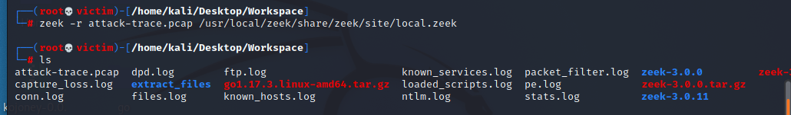

# 计算机取证

## 实验目的

- 了解计算机取证的基本原理和实现方法

## 实验要求

- [x] 使用 zeek 来完成取证分析

## 实验环境


## 实验过程

### 课内实验

1. 统计主机信息

2. ```bash
   tshark -r attack-trace.pcap -z ip_hosts,tree -qn
   ```

3. 

4. 一共只有两个ip地址在这个流量包中

5. 谁主动发起网络连接

6. ```bash
   tshark -r attack-trace.pcap -Y "tcp.flags == 0x02" -n
   ```

7. 

8. 可以推断98.114.205.102 在攻击 192.150.11.111

9. 推断攻击持续时间

10. ```bash
    capinfos attack-trace.pcap
    ```

11. 

12. 自动分析攻击详情

13. ```bash
    suricata -r attack-trace.pcap
    ```

14. 

15. 查看 TCP 会话信息

    ```bash
    tshark -r attack-trace.pcap -qnz conv,tcp
    ```

    

猜测：五个TCP会话对应3个不同的攻击阶段，扫描、漏洞利用、后渗透

6. 查看各个阶段的数据包

```bash
# 5.1 查看扫描阶段的数据包
tshark -r attack-trace.pcap -Y "tcp.stream eq 0"

# 5.2 查看漏洞利用阶段的数据包
tshark -r attack-trace.pcap -Y "tcp.stream eq 1"

# 查看该阶段 TCP 会话的应用层负载数据
tshark -r attack-trace.pcap -q -z follow,tcp,hex,1

# 把该阶段的通信数据另存为 pcap 文件
tshark -r attack-trace.pcap -q -z follow,tcp,hex,1 -w exploit.pcapng

# 使用 Wireshark 进行「应用层负载」另存为操作

# 5.3 执行攻击指令（漏洞利用之发送攻击负载）
tshark -r attack-trace.pcap -q -z follow,tcp,ascii,2

# 5.4 后渗透阶段
tshark -r attack-trace.pcap -q -z follow,tcp,ascii,3

# 5.5 后渗透阶段（下载后门程序）
tshark -r attack-trace.pcap -q -z follow,tcp,hex,4

# 把该阶段的通信数据另存为 pcap 文件
tshark -r attack-trace.pcap -q -z follow,tcp,hex,4 -w malware.pcapng
```


### 课后实验

#### 安装zeek

- 查看python版本

  

  

```shell
# 如果系统使用的 Python 版本是 3.x
apt update && apt-get install cmake make gcc g++ flex bison libpcap-dev libssl-dev python-dev swig zlib1g-dev

# 下载 zeek 源码包
wget http://sec.cuc.edu.cn/ftp/soft/zeek-3.0.0.tar.gz

# 解压缩 zeek 源码
tar zxf zeek-3.0.0.tar.gz

# 进入 zeek 源码解压缩后目录
cd zeek-3.0.0

# 生成构建脚本
./configure

# 构建成功后安装到构建脚本默认指定路径 /usr/local/zeek
make && make install

# 将 zeek 可执行文件目录添加到当前用户的 PATH 环境变量
if [[ $(grep -c '/usr/local/zeek/bin' ~/.bashrc) -eq 0 ]];then echo 'export PATH=/usr/local/zeek/bin:$PATH' >> ~/.bashrc;fi

# 重新读取 ~/.bashrc 以使环境变量设置即时生效
source ~/.bashrc
```


- 实验环境基本信息


#### 编辑 zeek 配置文件

- 编辑 `/usr/local/zeek/share/zeek/site/local.zeek` ，在文件尾部追加两行新配置代码

```bash
@load frameworks/files/extract-all-files
@load mytuning.zeek
```

- 在 `/usr/local/zeek/share/zeek/site` 目录下创建新文件 `mytuning.zeek` ，[内容为](https://www.bro.org/documentation/faq.html#why-isn-t-bro-producing-the-logs-i-expect-a-note-about-checksums)：

```bash
redef ignore_checksums = T;
```


#### 使用 zeek 自动化分析 pcap 文件

```bash
zeek -r attack-trace.pcap /usr/local/zeek/share/zeek/site/local.zeek
```



在 `attack-trace.pcap` 文件的当前目录下会生成一些 `.log` 文件和一个 `extract_files` 目录，在该目录下我们会发现有一个文件。


将该文件上传到 [virustotal](https://virustotal.com/) 我们会发现匹配了一个 [历史扫描报告](https://virustotal.com/en/file/b14ccb3786af7553f7c251623499a7fe67974dde69d3dffd65733871cddf6b6d/analysis/) ，该报告表明这是一个已知的后门程序！


至此，基于这个发现就可以进行逆向倒推，寻找入侵线索了。

通过阅读 `/usr/local/zeek/share/zeek/base/files/extract/main.zeek` 的源代码

我们了解到该文件名的最右一个-右侧对应的字符串 `FHUsSu3rWdP07eRE4l` 是 `files.log` 中的文件唯一标识。

通过查看 `files.log` ，发现该文件提取自网络会话标识（ `zeek` 根据 IP 五元组计算出的一个会话唯一性散列值）为 `CVLa2U21NxgxpiUvo5` 的 FTP 会话。


该 `CVLa2U21NxgxpiUvo5` 会话标识在 `conn.log` 中可以找到对应的 IP 五元组信息。


通过 `conn.log` 的会话标识匹配，我们发现该PE文件来自于IPv4地址为：`98.114.205.102` 的主机。

#### Zeek 的一些其他技巧

- `ftp.log` 中默认不会显示捕获的 FTP 登录口令，我们可以通过在 `/usr/local/zeek/share/zeek/site/mytuning.zeek` 中增加以下变量重定义来实现：

```bash
redef FTP::default_capture_password = T;
```


在没有添加此行命令前，列中无password


在添加此行变量后，重新分析，就能得到password一列

- 使用正确的分隔符进行过滤显示的重要性

```bash
# 从头开始查看日志文件，显示前1行
head -n1 conn.log

# Bro的日志文件默认使用的分隔符显示为ASCII码\x09，通过以下命令可以查看该ASCII码对应的“可打印字符”
echo -n -e '\x09' | hexdump -c

# 使用awk打印给定日志文件的第N列数据
awk -F '\t' '{print $3}' conn.log
```


- 查看Bro的超长行日志时的横向滚动技巧

```bash
less -S conn.log
```


- 使用 `zeek-cut` 更“优雅”的查看日志中关注的数据列

```bash
# 查看conn.log中所有可用的“列名”
grep ^#fields conn.log | tr '\t' '\n'

# 按照“列名”输出conn.log中我们关注的一些“列”
zeek-cut ts id.orig_h id.orig_p id.resp_h id_resp_p proto < conn.log

# 将UNIX时间戳格式转换成人类可读的时间（但该方法对于大日志文件处理性能非常低）
zeek-cut -d < conn.log
```


## 遇到的问题和解决方法

- 在编译时文件出现错误


**解决方法：**在对应文件中，添加`#include <stdexcept> #include <limits>`

## 参考资料

- [error: 'numeric_limits' is not a member of 'std' #474](https://github.com/onnx/onnx-tensorrt/issues/474)

- [第十二章教材](https://c4pr1c3.github.io/cuc-ns/chap0x12/exp.html)

